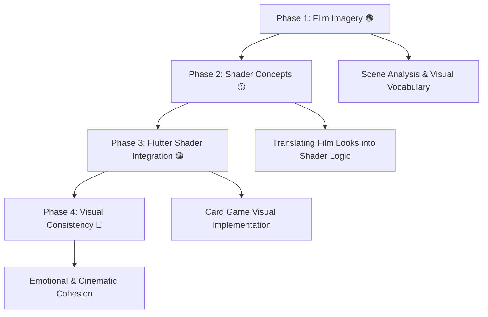

# 🎨 Visual Language & Shader Coding Study (Flutter Focus)

This repository explores how **visual language in film** can inspire **shader-based visual design** for 2D games focusing on **emotion, color, and texture** rather than 3D realism.  

> _“Studying how cinematic imagery can live inside interactive flat worlds.”_

---

## 🧩 Study Landscape

```text
Visual Storytelling
├── Film Imagery Analysis 🟢 *Current Focus*
│   ├── Composition, Color, Light, Texture
│   └── Symbolism & Visual Mood
├── Shader Design 🟡 *Next*
│   ├── Fragment Shaders (GLSL)
│   ├── Procedural Light, Blur, Grain, Tint
│   └── Color Grading & Post-FX for 2D Cards
└── Visual Integration in WebComponents and Flutter 🟣 *Future*
    ├── Applying Shaders to Card Elements
    ├── Interactive Layering (hover, selection)
    └── Cinematic Style Consistency Across Scenes
```

---

### Notes & Explanations
Reference documents explaining technologies and language choices.

See:
- `docs/notes/shader_languages.md`
- `docs/notes/flutter_rendering.md`
- `docs/notes/roadmap_shader_targets.md`

---

## 🎓 Plan of Study

A practical, art-driven roadmap connecting **film analysis** → **shader experimentation** → **Flutter implementation**.

### **Phase 1 – Visual Language Foundations**
- Use the *Visual Study Notebook* to analyze film scenes  
- Focus on **color palettes**, **framing**, **contrast**, and **symbolism**  
- Learn to describe visuals in emotional and cinematic terms  
- Build a **moodboard** of flat compositions suitable for translation into 2D effects

### **Phase 2 – Film Imagery to Shader Logic**
- Translate studied looks into shader concepts (e.g., glow, vignetting, fog)  
- Learn core **GLSL syntax** and **fragment shader math**  
- Explore **light falloff**, **noise**, **blend modes**, and **color tinting**  

### **Phase 3 – Flutter Shader Implementation**
- Prototype looks in Flutter’s shader API (`FragmentProgram`, `ShaderBuilder`, etc.)
- Integrate shaders into your card game prototype  
- Apply effects to specific elements (cards, background, overlays)  
- Test **dynamic states** — e.g., hover glow, selection pulse, match start shimmer  
- Optimize for web & mobile performance (texture resolution, precision hints)

### **Phase 4 – Visual Consistency & Emotion**
- Define your game’s **cinematic tone** (noir, dreamy, vibrant, melancholic, etc.)  
- Create a unified **shader style guide** for cards, transitions, and UI  
- Study how color and motion evoke emotion in 2D games  
- Reflect on how your shaders “speak” in the same visual language as film

---

## 🗺️ Visual–Shader Roadmap



---

## 🔬 Current Research & Experiments

| Topic | Status | Summary |
|-------|--------|----------|
| **[Film Scene Analysis Notebook](research/scene-study-template.md)** | 🟢 | Analyzing composition, light, and color in reference films |
| **[Intro to Flutter Shaders](research/flutter-shader-intro.md)** | 🟡 | Basics of integrating GLSL-like shaders into Flutter |
| **[Shader Translation Study](research/film-to-shader-mapping.md)** | 🟣 | Mapping cinematic looks to shader parameters and math |
| **[Cinematic Card Effects](research/card-game-shader-styles.md)** | 🔵 | Designing flat, film-inspired effects for Flutter games |
### NEW: In-Helmet Display – Language Trainer (80s HUD)
A goal-based mini-study that simulates a retro visor UI which glitches between English ↔ Toki Pona and then stabilizes on Toki Pona. Includes three shaders (simple → advanced) and a small Flutter demo. See: `docs/studies/in-helmet-display/README.md`.


### 📄 Research Files

- [🎬 Scene Study Template](research/scene-study-template.md)
- [🌈 Intro to Flutter Shaders](research/flutter-shader-intro.md)
- [🎞️ Film-to-Shader Mapping](research/film-to-shader-mapping.md)
- [🂡 Cinematic Card Effects](research/card-game-shader-styles.md)

---

## 🧠 Future Research

| Topic | Status | Summary |
|-------|--------|----------|
| **[Procedural Lighting in 2D](research/future/procedural-lighting.md)** | 🧪 | Creating depth and atmosphere in flat scenes |
| **[Emotion Through Color & Texture](research/future/color-emotion-shaders.md)** | 🧪 | Using shader-driven color changes to reflect game states |
| **[Shader Optimization for Mobile](research/future/flutter-shader-performance.md)** | 🧪 | Ensuring smooth rendering across devices |

---

## 🎥 Study Approach: Start Simple, Build Up

This project follows a **progressive learning approach** — starting with simple shader effects and gradually layering complexity inspired by cinematic imagery.

1. Begin with basic fragment shaders (film grain, color tint, vignette).  
2. Apply them to your 2D card game using Flutter’s shader API.  
3. Analyze how these visual effects mirror filmic techniques (composition, color, tone).  
4. Incrementally combine effects to simulate cinematic moods (e.g., noir, dreamy, retro).  

> _“Build from simplicity — each small shader teaches one piece of visual language.”_

---

## 🌐 Resources & Inspiration

Here are key references used to guide shader development and visual research:

| # | Resource | Description |
|---|-----------|--------------|
| 1 | [**Writing & using fragment shaders (Flutter Docs)**](https://docs.flutter.dev/ui/design/graphics/fragment-shaders?utm_source=chatgpt.com) | Official Flutter guide for loading and using `.frag` shaders. Essential for setup and understanding. |
| 2 | [**Shady Flutter: Using GLSL Shaders in Flutter**](https://blog.codemagic.io/shady-flutter/?utm_source=chatgpt.com) | Hands-on intro with GLSL shader examples in Flutter — practical for 2D visual effects. |
| 3 | [**Practical Fragment Shaders in Flutter – Droids on Roids**](https://www.thedroidsonroids.com/blog/fragment-shaders-in-flutter-app-development?utm_source=chatgpt.com) | Explains fragment shaders with clear examples, ideal for learning Flutter shader workflow. |
| 4 | [**Analyzing Optic & Filmic Effects in WebGL**](https://medium.com/%40josecastrovaron/analyzing-optic-and-filmic-effects-in-webgl-47abe74df74e?utm_source=chatgpt.com) | Visual deep-dive into film grain, LUTs, and color grading — useful for connecting film language to shader logic. |
| 5 | [**Film Grain Shader Example (GLSL)**](https://gameidea.org/2023/12/01/film-grain-shader/?utm_source=chatgpt.com) | Simple yet powerful example shader for film grain — perfect as a starting effect. |

---

## 🔄 Project Continuation

This repository is part of an ongoing creative research series exploring film imagery and shaders.

To continue from where the last session left off, see:  
👉 [**NEXT_STEPS.md**](NEXT_STEPS.md)

That file tracks the most recent progress, current focus, and upcoming experiments.


---

## 🚀 Start here for new sessions

If you're opening this project in a **fresh ChatGPT session** (or for a new collaborator):

1. Read **`START_HERE_FOR_CHATGPT.md`** for the bootstrapping instructions and project preferences.
2. Then read **`NEXT_STEPS.md`** to continue from the topmost unchecked item.
3. Keep code clean, modern, and well-commented; target **WebGL2 / GLSL ES 3.00** and use `shaders/manifest.json`.

