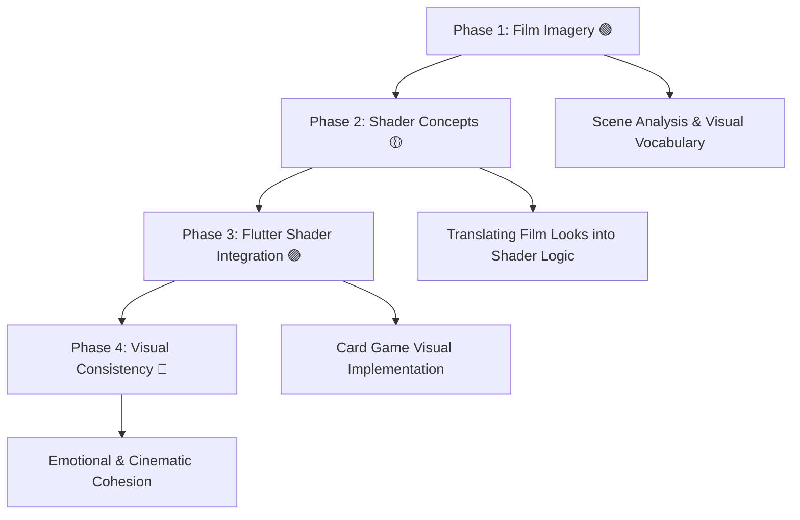

# 🎨 Visual Language & Shader Coding Study (Flutter Focus)

This repository explores how **visual language in film** can inspire **shader-based visual design** for 2D games built in **Flutter** — focusing on **emotion, color, and texture** rather than 3D realism.  

> _“Studying how cinematic imagery can live inside interactive flat worlds.”_

---

## 🧩 Study Landscape

```text
Visual Storytelling
├── Film Imagery Analysis 🟢 *Current Focus*
│   ├── Composition, Color, Light, Texture
│   └── Symbolism & Visual Mood
├── Shader Design in Flutter 🟡 *Next*
│   ├── Fragment Shaders (GLSL → Flutter)
│   ├── Procedural Light, Blur, Grain, Tint
│   └── Color Grading & Post-FX for 2D Cards
└── Visual Integration 🟣 *Future*
    ├── Applying Shaders to Card Elements
    ├── Interactive Layering (hover, selection)
    └── Cinematic Style Consistency Across Scenes
```

---

## 🎓 Plan of Study

A practical, art-driven roadmap connecting **film analysis** → **shader experimentation** → **Flutter implementation**.

### **Phase 1 – Visual Language Foundations**
- Use the *Visual Study Notebook* to analyze film scenes  
- Focus on **color palettes**, **framing**, **contrast**, and **symbolism**  
- Learn to describe visuals in emotional and cinematic terms  
- Build a **moodboard** of flat compositions suitable for translation into 2D effects

### **Phase 2 – Film Imagery to Shader Logic**
- Translate studied looks into shader concepts (e.g., glow, vignetting, fog)  
- Learn core **GLSL syntax** and **fragment shader math**  
- Explore **light falloff**, **noise**, **blend modes**, and **color tinting**  
- Prototype looks in Flutter’s shader API (`FragmentProgram`, `ShaderBuilder`, etc.)

### **Phase 3 – Flutter Shader Implementation**
- Integrate shaders into your card game prototype  
- Apply effects to specific elements (cards, background, overlays)  
- Test **dynamic states** — e.g., hover glow, selection pulse, match start shimmer  
- Optimize for web & mobile performance (texture resolution, precision hints)

### **Phase 4 – Visual Consistency & Emotion**
- Define your game’s **cinematic tone** (noir, dreamy, vibrant, melancholic, etc.)  
- Create a unified **shader style guide** for cards, transitions, and UI  
- Study how color and motion evoke emotion in 2D games  
- Reflect on how your shaders “speak” in the same visual language as film

---

## 🗺️ Visual–Shader Roadmap



---

## 🔬 Current Research & Experiments

| Topic | Status | Summary |
|-------|--------|----------|
| **[Film Scene Analysis Notebook](research/scene-study-template.md)** | 🟢 | Analyzing composition, light, and color in reference films |
| **[Intro to Flutter Shaders](research/flutter-shader-intro.md)** | 🟡 | Basics of integrating GLSL-like shaders into Flutter |
| **[Shader Translation Study](research/film-to-shader-mapping.md)** | 🟣 | Mapping cinematic looks to shader parameters and math |
| **[Cinematic Card Effects](research/card-game-shader-styles.md)** | 🔵 | Designing flat, film-inspired effects for Flutter games |


---

## 🧠 Future Research

| Topic | Status | Summary |
|-------|--------|----------|
| **[Procedural Lighting in 2D](research/procedural-lighting.md)** | 🧪 | Creating depth and atmosphere in flat scenes |
| **[Emotion Through Color & Texture](research/color-emotion-shaders.md)** | 🧪 | Using shader-driven color changes to reflect game states |
| **[Shader Optimization for Mobile](research/flutter-shader-performance.md)** | 🧪 | Ensuring smooth rendering across devices |

---

## 🛠️ Tools & Framework

| Tool | Use |
|------|-----|
| **Flutter / Dart** | Core game and UI platform |
| **GLSL (via Flutter Shader API)** | Real-time fragment shader logic |
| **Notion / GitHub** | Research and progress documentation |
| **Visual Notebook (.docx)** | Scene breakdowns and personal notes |

---

---

## 🔄 Project Continuation

This repository is part of an ongoing creative research series exploring film imagery and shaders in Flutter.

To continue from where the last session left off, see:  
👉 [**NEXT_STEPS.md**](NEXT_STEPS.md)

That file tracks the most recent progress, current focus, and upcoming experiments.
