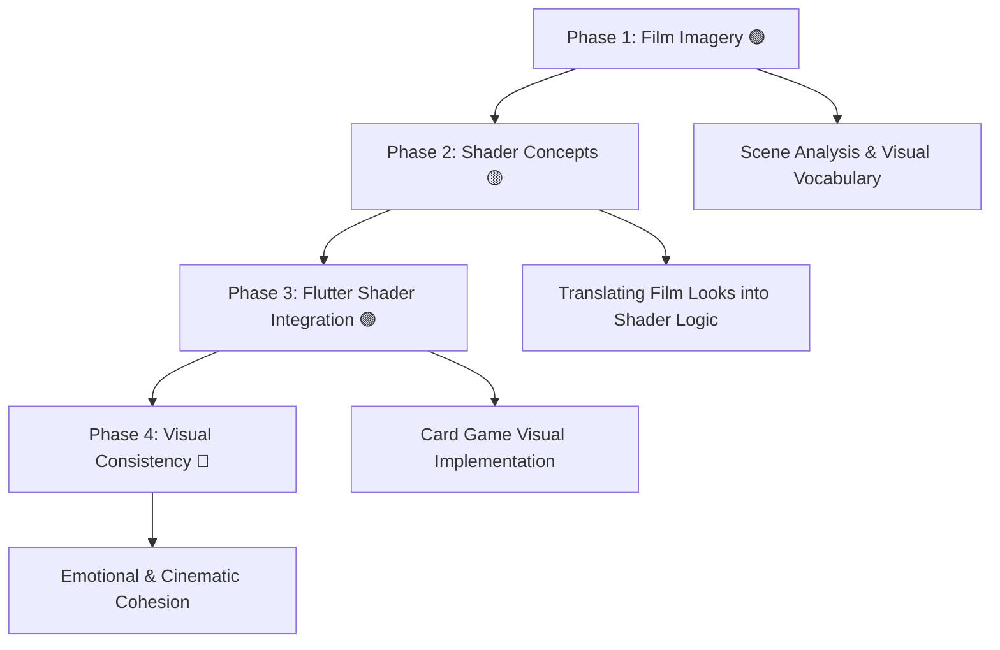

## 🎓 Plan of Study

A practical, art-driven roadmap connecting **film analysis** → **shader experimentation** → **Flutter implementation**.

## 🗺️ Visual–Shader Roadmap

### **Phase 1 – Visual Language Foundations**
- Use the *Visual Study Notebook* to analyze film scenes  
- Focus on **color palettes**, **framing**, **contrast**, and **symbolism**  
- Learn to describe visuals in emotional and cinematic terms  
- Build a **moodboard** of flat compositions suitable for translation into 2D effects

### **Phase 2 – Film Imagery to Shader Logic**
- Translate studied looks into shader concepts (e.g., glow, vignetting, fog)  
- Learn core **GLSL syntax** and **fragment shader math**  
- Explore **light falloff**, **noise**, **blend modes**, and **color tinting**  

### **Phase 3 – Flutter Shader Implementation**
- Prototype looks in Flutter’s shader API (`FragmentProgram`, `ShaderBuilder`, etc.)
- Integrate shaders into your card game prototype  
- Apply effects to specific elements (cards, background, overlays)  
- Test **dynamic states** — e.g., hover glow, selection pulse, match start shimmer  
- Optimize for web & mobile performance (texture resolution, precision hints)

### **Phase 4 – Visual Consistency & Emotion**
- Define your game’s **cinematic tone** (noir, dreamy, vibrant, melancholic, etc.)  
- Create a unified **shader style guide** for cards, transitions, and UI  
- Study how color and motion evoke emotion in 2D games  
- Reflect on how your shaders “speak” in the same visual language as film

